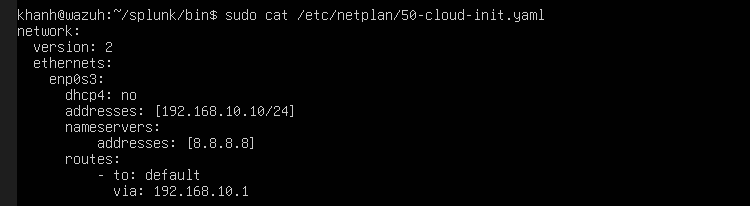
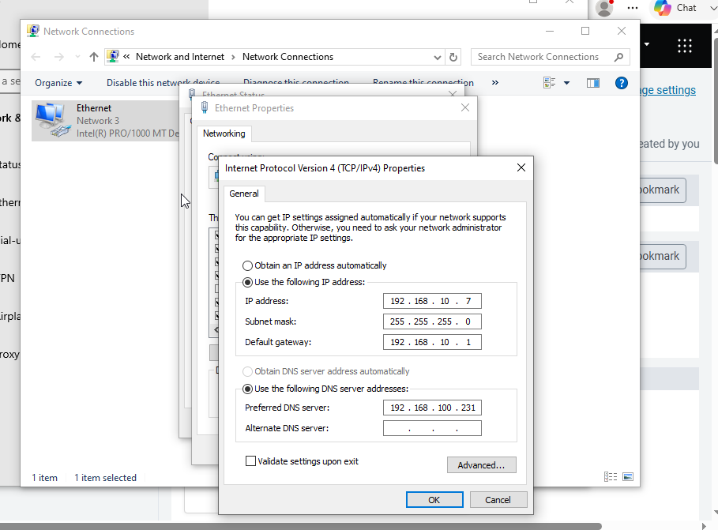
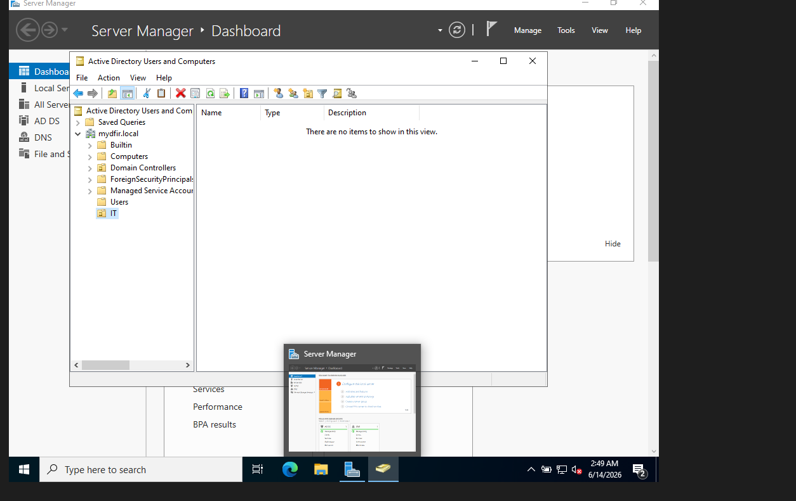

# Active Directory Detection Lab with Splunk, Sysmon, Windows Server, Windows 10 and Kali Linux

## 1. Overview

This project documents my personal Active Directory security monitoring lab. The main goal of this lab is to build a small enterprise-like environment where Windows logs, Sysmon events, authentication activities, and attack simulation traces can be collected and analyzed using Splunk.

The lab is designed for learning defensive security, log analysis, detection engineering, and SOC investigation workflow.

## 2. Lab Architecture

The lab contains four virtual machines:

| Machine        | Role              | Purpose                                                                        |
| -------------- | ----------------- | ------------------------------------------------------------------------------ |
| Windows Server | Domain Controller | Active Directory, DNS, domain user and group management                        |
| Windows 10     | Victim / Endpoint | Domain-joined endpoint, Sysmon installed, Splunk Universal Forwarder installed |
| Ubuntu Server  | Splunk Server     | Receives logs from Windows endpoint and provides dashboard/search capability   |
| Kali Linux     | Attacker Machine  | Used only inside the isolated lab network for controlled attack simulation     |

## 3. Network Design

The lab uses an isolated Host-Only network with the following subnet:

```text
192.168.10.0/24
```

Example IP planning:

| Machine                            |    Example IP | Description                              |
| ---------------------------------- | ------------: | ---------------------------------------- |
| Windows Server / Domain Controller | 192.168.10.10 | AD DS, DNS                               |
| Windows 10 Victim                  | 192.168.10.20 | Endpoint sending logs to Splunk          |
| Ubuntu Splunk Server               | 192.168.10.30 | Splunk Enterprise server                 |
| Kali Linux                         | 192.168.10.40 | Lab attacker machine                     |
| Gateway / Host-only adapter        |  192.168.10.1 | VirtualBox / Oracle VM host-only network |

The DNS server on the Windows 10 victim points to the Windows Server Domain Controller:

```text
DNS: 192.168.10.10
```

This is required so the Windows 10 machine can resolve the Active Directory domain correctly and join the domain.

## 4. Main Components

### 4.1 Windows Server

The Windows Server machine is configured as a Domain Controller.

Domain used in this lab:

```text
mydfir.local
```

The server is responsible for:

* Active Directory Domain Services
* DNS resolution for domain clients
* Domain user management
* Group management
* Authentication events

Example Active Directory structure:

```text
Domain: mydfir.local
Group: IT
User: khanh canh
```

The purpose of creating users and groups is to simulate a realistic enterprise environment where authentication, remote access, and lateral movement traces can be observed from logs.

### 4.2 Windows 10 Victim

The Windows 10 machine is joined to the Active Directory domain.

This machine is used as the monitored endpoint. It has:

* Sysmon installed
* Splunk Universal Forwarder installed
* DNS configured to point to the Domain Controller
* Remote access enabled for controlled lab testing
* Logs forwarded to the Splunk Server

The Windows 10 victim sends Windows Event Logs and Sysmon logs to the Splunk Server.

### 4.3 Ubuntu Splunk Server

The Ubuntu Server is used as the Splunk Server.

Splunk receives logs from the Windows 10 victim through the Splunk Universal Forwarder.

The main index used in this lab is:

```text
endpoint
```

Important note:

The index configured inside `inputs.conf` must exist on the Splunk Server. If the index name is wrong or does not exist, Splunk may receive the data incorrectly or the logs may not appear when searching the expected index.

Example Splunk search:

```spl
index=endpoint
```

### 4.4 Kali Linux Attacker

Kali Linux is used only inside the isolated lab network for controlled security testing.

The purpose of this machine is to generate test activity so that logs can be collected and investigated in Splunk.

Example activities that can be studied defensively:

* Authentication failures
* Successful logons
* Remote access activity
* Suspicious parent-child process relationships
* Sysmon process creation events
* Network connection events
* Lateral movement traces in a controlled lab

This project does not target any real system. All testing is performed only inside the isolated lab environment.

## 5. Splunk Universal Forwarder Configuration

The Splunk Universal Forwarder is installed on the Windows 10 victim.

Recommended path for local configuration:

```text
C:\Program Files\SplunkUniversalForwarder\etc\system\local\inputs.conf
```

Important:

Do not edit files inside the `default` folder unless required for testing. In Splunk, the recommended practice is to place custom configuration inside the `local` folder.

The `inputs.conf` file is used to define what logs should be collected and which index they should be sent to.

Example monitored logs:

* Windows Security logs
* Windows System logs
* Windows Application logs
* Sysmon Operational logs

## 6. Sysmon

Sysmon is used to collect detailed endpoint telemetry.

Sysmon helps capture events such as:

| Sysmon Event ID | Description                     |
| --------------: | ------------------------------- |
|               1 | Process Creation                |
|               3 | Network Connection              |
|               7 | Image Loaded                    |
|               8 | CreateRemoteThread              |
|              10 | Process Access                  |
|              11 | File Create                     |
|              12 | Registry Object Created/Deleted |
|              13 | Registry Value Set              |
|              22 | DNS Query                       |

These events are useful for detection engineering and threat hunting.

## 7. Example Hunting Searches

Search all endpoint logs:

```spl
index=endpoint
```

Search Sysmon logs:

```spl
index=endpoint source="XmlWinEventLog:Microsoft-Windows-Sysmon/Operational"
```

Search process creation events:

```spl
index=endpoint EventCode=1
```

Search failed logon events:

```spl
index=endpoint EventCode=4625
```

Search successful logon events:

```spl
index=endpoint EventCode=4624
```

Search suspicious PowerShell activity:

```spl
index=endpoint powershell OR PowerShell OR pwsh
```

Search Sysmon network connections:

```spl
index=endpoint EventCode=3
```

## 8. Lab Goal

The goal of this lab is to understand how endpoint logs are generated, forwarded, stored, and analyzed.

This lab helps me practice:

* Active Directory administration basics
* Windows event logging
* Sysmon configuration
* Splunk Universal Forwarder setup
* Splunk index and search usage
* Detection logic
* SOC investigation mindset
* Basic attack simulation in an isolated environment
* Log-based threat hunting

## 9. Screenshots

### Splunk Server Network Configuration




### Windows 10 Victim Network Configuration



### Active Directory Domain Controller



### Splunk Dashboard

Add screenshot here:

```text
docs/images/splunk-dashboard.png
```

### Kali Linux Network Configuration

Add screenshot here:

```text
docs/images/kali-network.png
```

## 10. Important Notes

This lab is for educational and defensive security learning only.

Do not use the techniques, tools, or ideas from this lab against systems that you do not own or do not have permission to test.

Sensitive information such as real passwords, tokens, private keys, license files, and personal data should not be uploaded to GitHub.

## 11. Future Improvements

Planned improvements:

* Add more Splunk detection searches
* Add dashboard screenshots
* Add Windows Event ID explanation
* Add Sysmon Event ID explanation
* Add brute-force detection notes
* Add lateral movement detection notes
* Add alerting examples
* Add Sigma rule mapping
* Add MITRE ATT&CK mapping

## 12. Author

Created by: `<your-name>`

Purpose: Personal cybersecurity lab, SOC learning, Active Directory monitoring, Splunk and Sysmon practice.
